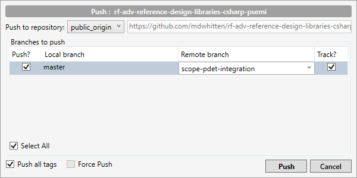

# Setup and Workflow

There are two primary modes in which this repository might be used: contributions to the project that are open source, and private development projects leveraging the code that may or may not contribute back to the project.

+ [Open Source Contribution Workflow](#open-source-contribution-workflow)
+ [Private Development Workflow](#private-development-workflow)
	- [Duplicating the Public Repository](#duplicating-the-public-repository)
	- [Connecting the Private and Public Repositories](#connecting-the-private-and-public-repositories)
	- [Merging Changes from the Public Repository](#merging-changes-from-the-public-repository)
	- [Contributing to the Public Repository](#contributing-to-the-public-repository)

### Open Source Contribution Workflow

*For a more complete workflow, view [this workflow guide](https://decibel.ni.com/content/docs/DOC-37417).*

1. Fork this repository into your account.
2. Create a branch for your change.
3. Make changes, periodically pulling and merging any updates from the central repository.
4. Push your changes up to your branch in your copy of the repository.
5. Send a pull request to the owner of this primary repository. Follow the contribution guidelines.

### Private Development Workflow

For many projects, it will make more sense to create a private clone of this repository in order to be able to implement code specific to the intended application. This may not be generally useful to others or may contain secret information, so a public repository does not make sense. Additionally, a separate copy of the repository means that you can utilize some of the useful features of GitHub the branches, issue tracking, and commit history.

Unfortunately, it is not possible to fork a public repository and make it private. Instead, you will need to clone the repository to a private repository, and then configure settings for the repo to allow you to continue to pull from the public master and eventually submit pull requests from your private repo.

The steps below will show you how to setup this configuration in GitHub and using the desktop application [SourceTree](https://www.sourcetreeapp.com/) to connect to the remote repository. SourceTree was chosen because the native GitHub desktop client does not allow for adding remote repositories. All of these steps can be repeated either via the git command line or in another tool that supports these features.

#### Duplicating the Public Repository

1. First, [import the public repository](https://help.github.com/en/articles/importing-a-repository-with-github-importer) to create a private copy of the repository on your GitHub account.
2. Clone (download locally) the newly created repo by navigating to **File » Clone/New** in SourceTree
3. Enter the URL from the newly created repository, [accessible from the GitHub page](https://help.github.com/en/articles/which-remote-url-should-i-use). This will create a local copy of the repository on your computer.

#### Connecting the Private and Public Repositories

Now, we want to add a new *remote* repository. A remote repo is hosted somewhere other than the local computer. The private repository that we just cloned from GitHub is technically also a remote repository, with the default name *origin*. We are going to setup an additional remote repository in order to also connect to the public repository. 

1. In SourceTree, navigate to **Repository » Add Remote...** 
2. From the *Repository Settings* view, select **Add** to add a new remote repository path
3. Under *Remote Name*, enter a name to indicate that this is the public repository, such as **public_origin**
4. Enter the URL as before, and SourceTree should automatically identify the repository as belonging to GitHub 
5. Click **OK** to add the new remote repository, and you should see the default **origin** (the cloned repository you created) and the new remote origin connecting to the public GitHub repo
   
   

#### Merging Changes from the Public Repository

Now that you have configured the public repository as a remote repository, you will be able to merge changes that are made in the public repository into your private repository, even while your code develops independently.

To retrieve the latest changes from the public repository, right-click the repository name under the *Remotes* section and select **Fetch from *public_repo_name***. If there are new changes in the public repository, you will see something like the following in the *History* view:

In this example above, the names in the screenshot above refer to the following:

-  refers to the latest commit of the master branch on the local machine
-  refers to the latest commit of the master branch on *origin*, which is the default name for the private copy of the repository you created which is  hosted on the remote server
-  refers to the public repository that was added as a remote repository in the previous section

As you can see, **public_origin** has new changes that have been implemented in the public repository. If you would like to integrate some or all of those changes in your private repository, follow these steps:

1. Right-click on the commit that you would like to merge into your private repository, and select **Merge...**
2. If the merge is successful, you will now have integrated the changes from the public repository into your local repository. To push these changes to your remote private repository, press the **Push** button.

#### Contributing to the Public Repository

If you have developed new features, improved existing code, or fixed bugs that would be valuable to contribute back to the public repository, please follow the procedure below. Normally, when you fork a repository, you can simply open a pull request from the forked repository in order to contribute changes back to the source. However, in this case we have to perform a few extra steps because we have cloned the repository rather than forking it.

1. Open the public repository in GitHub, and [create a new branch](https://help.github.com/en/articles/creating-and-deleting-branches-within-your-repository) with one of the following formats: *your-name-feature-description*, *your-name-improvement-description*, or *your-name-bug-fix-description*.

2. In SourceTree on your local machine, right-click on the public repository under the *Remotes* section and select **Push to *public_repo_name***

3. In the dialog that appears, select the remote branch that you have just created. **Note - you cannot push to the master branch of the public repository**. You will receive an error if you try to do so.

   

4. Ensure that your local branch is selected under *Push?*, and press **Push** to commit your changes to the public branch that you created.

5. From your branch on the GitHub website, [create a new pull request](https://help.github.com/en/desktop/contributing-to-projects/creating-a-pull-request). A [pull request](https://help.github.com/en/articles/about-pull-requests) notifies the owner and contributors to a repository that you would like to integrate changes into the master branch, and initiates a review process.

From here, the owner and contributors to the project will have the opportunity to review your commit to ensure that it is fully functional, meets the [contribution guidelines](Contributing.md), and is ready to be integrated into the master branch. It may also have to pass automated testing routines before it can be accepted.
